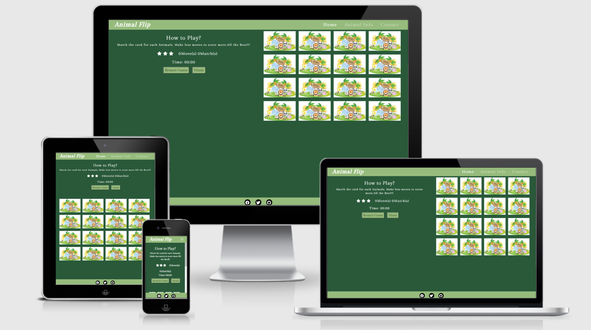

# Animal Flip
## A Memory Game Website created by Vijayalakshmi Dhandapani
[View live site here](https://vijusuren.github.io/my-MS2/)
### [GitHub](https://github.com/vijusuren/my-MS2)

# Milestone Project 2
## Table of Contents
* [**Project overview**](#project-overview)
* [**UX**](#ux)
  - [**User Goals**](#user-goals)
  - [**User Stories**](#user-stories)
  - [**Design**](#design)
  - [**Libraries**](#libraries)
  - [**Colour Scheme**](#colour-scheme)
  - [**Wireframes**](#wireframes)

* [**Features**](#features)
  - [**Existing Features**](#existing-features)
  - [**Features Left to Implement**](#features-left-to-implement)

* [**Technologies Used**](#technologies-used)

* [**Testing**](#testing)
  - [**Validation**](#validation)
  - [**Testing User Stories**](#testing-user-stories)

* [**Deployment**](#deployment)

* [**Credits**](#credits)
  - [**Content**](#content)
  - [**Code**](#code)
  - [**Acknowledgements**](#acknowledgements)

## Project Overview
This Website was created for the purpose of completing the Second Milestone Project for the Code Institute's Full Stack Developer Course.
The purpose of this project is to make a fun memory game for both kids and adults.Kids will enjoy the interactive game with beautiful images 
and mild sound clips, and adults can also enjoying while playing. There are fun facts about each and every animals sure to learn something interesting about animal.

## UX 
### User Goals
- Display and work on all devices from large screen monitors, Laptops to tablets and phones.
- Provide an interactive scoring game for animals that would challenge the user's memory.
- Provide fun facts about animals based on the pictures in the memory game.
- Provide a contact page for a user to receive new updates of upcoming games.

### User Stories
From the designer perspective:-
- The site needs to easy to use and navigate.
- The site colour and backgrounds needs to attract on the eye.
- The picture on the site need to be clear so that user can easily identify the animal.
- The Animalinfo page have some effects on Image. And easy to read and learn some interesting things.
- The contact form needs to be easy to enter the information to attract more people.

From the User perspective:-
- As a user, I want to find the game a challenge but not hard.
- As a user, I want to learn some interesting information about animal.
- As a user, I want to know how much moves I took to finish the game.
- As a user, I want to restart my game if I make a mistake.
- As a user, I want to have some background music.
- As a user, I want to contact the game maker and give my feedback.
- As a user, I want to the website to make me want to visit and play the game again. 

### Design
#### Strategy
The main aim to build this game is to test my knowledge of **JavaScript** and learn more in the building process. To select Animal for memory games because animals are easily attracted by both kids and adults.
I wanted a simple game that has easy to understand and site is easy to navigate through.

#### Scope
- I wanted to make a memory game that is easy to play and images should be different from each other so that it will test the memory of the user.
- There will be one Restart button to restart the game and Music button to control the background music.
- Timer will be there to show the time taken to complete the game in minutes and seconds.
- After finishing the game popup message will occur with claps sound shows the Moves taken, Stars and Time taken to complete the game.
- Animal Info page site have the information about animals.
- The contact page will be a contact form to get the feedback from the players.
- And link to social network will also be in site.

#### Structure
- This website contains three pages which are linked to each other through Navigation bar and also fixed.
- The Header section will have Introduction of the game, How to play instructions, Moves and match counter.
- The timer to show the game timing in minutes and seconds.
- The star counter (which will show 3 stars for less than 14 moves, 2 stars for moves between 14 and 22, and 1 star for moves more than 23). 
- The first page memory game will be on Home page. The second page will be Animal Info contains some  information about animal.
- The last page will be the contact page to give the feedback about the game and website.
- The footer section will be fixed at the bottom having link to social network.

#### Skeleton
## Wireframes 
- [Home Page](assets/wireframe/Home_page.pdf)
- [Animal Info](assets/wireframe/Animalinfo_page.pdf)
- [Contact Page](assets/wireframe/Contact_page.pdf)

#### Surface
## Colour Scheme
- The background color is Kaitoke Green![#295939]
- Navigation bar and Footer bar is Olivine![#96bb7c]
- Restart button and Music button is Olivine![#96bb7c]

## Libraries
- [Bootstrap 4.5](https://getbootstrap.com) - is a framework for building responsive, mobile-first websites.

- [Google Font](https://fonts.google.com/) - is a font application.

## Images :
    
- All the Images are from google.
- Image of Animals from google.
- Card back image from (https://images.all-free-download.com/images/graphicthumb/zoo_cute_vector_148146.jpg)

**Sound**:
    
- The background music is from (www.fesliyanstudios.com/happy-music).

##### back to [top](#table-of-contents)
---

## Features

**Navigation Bar**

This website features a **Responsive** navigation bar on the top of the page with the brand name on the left 
and Menu links on the right. The brand name is linked to the Home page of the site. 
Menu links are linked to 3 different pages of the site. 
Home link is linked to the **index.html** page, Animal Info link is connected to the second-page **animalinfo.html** 
and the third link is contact, which is connected to the third-page **contact.html**.

**Home page**

The home page is having the game board which is 4X4 grid with a total of 16 images. 
The back image is of animal zoo and front image is of 8 different animal.

* Cheetah
* Deer
* Giraffe
* Hippopotamus
* Lion
* Rabbit
* Tiger
* Zebra

The heading has named of the game and instruction abut how to play the game.

**Moves and matches counter** shows how many moves have been made and how many matches have been done.

**Star ratings** will show the numbers of stars based on the moves made by the player, 
3 stars for less than 14 moves, 2 stars for moves between 14 and 22, and 1 star for moves more than 23.

A **Timer** will show the time taken by the player to finish the game in minutes and seconds.

The **Restart button** will restart the game when clicked.

**Music** button will play/mute the background music.

**Pop Up** modal is added to show with background applause sound when the game is finished.
The heading will show animated text in rainbow color.
It will show the number of moves taken to complete the game and the number of stars earned during the game. 
The timer in the modal shows the time taken to complete the game.

**Animal Info Page**

The second page of the website is the information page about animal. 
This has one drop down box to select a animal, and after selection, the page will show the 
**Fun Facts** and one big **Image** of the selected animal. 

**Contact Page**

The third page of the website has a **Contact form**, which is implemented to give feedback about the game. 
The contact form is connected to my Gmail account through **emailJS**, 
and the feedback submit button will become green and its text will turn to *Feedback Sent* after 
sending the feedback.

**Footer**
The footer is pinned to the bottom of all three pages and it has a link to social networks like **Facebook**,
**Twitter** and **Github**. The icons are represented from **Font awesome** icons.

### Existing Features

- Navigation bar is fixed on top, the page links are grey and when hovered or chosen page is live and these are colored with white.
- The game board contains a grid which stays the same grid on all devices from large screen devices to tablets and phones.
- When a card is clicked it turnaround and show the image of animal user can remember where animal are to match the pair.
- The number of moves and matches are counted.
- The star rating also updated depending on the number of moves as a user can complete the game. This feature is added
to give feedback to the player about their game.
- Timer is added which starts with first card clicked and it will show the time taken to complete the game.
- The Restart button is added to reset the game board and restart the game. 
- The Music button is added to play the background music, which is mute automatically when the game finish.
- In the animal info page drop down box is added with list of animals in it to be selected.
- The fun facts is added as a user they can learn some interesting information about animal.
- The Contact form is added in the contact page to get feedback about the game.

### Features Left to Implement

- A popup section to be added for Easy, Medium and Hard level of game. This would allow to extend the grid to more
cards and more animal depending on the level selected.
- The sound effects and moving animation of Image would be added in the animalinfo page.
- User board to be added to display list of user who completed the game in less moves and time.

##### back to [top](#table-of-contents)
---

## Technologies Used

- [HTML5](https://en.wikipedia.org/wiki/HTML)
    * The language used to create and sort the content of the website.
- [CSS](https://en.wikipedia.org/wiki/CSS)
    * The language used to style the HTML5 elements according to the design purposes.
- [Javascript](https://en.wikipedia.org/wiki/JavaScript)
    * Javascript is used to add functionality and make the site more interactive.
- [jQuery](https://jquery.com/)
    * jQuery is used in making the site more interactive.
- [Bootstrap framework](https://getbootstrap.com/)
    * I decided to use Bootstrap's grid container system as I wanted to design my project with a 'mobile first' approach.
- [Gitpod](https://www.gitpod.io/)
    * I relied on Gitpod's dev environment to write the code for my project.
- [GitHub](https://github.com/)
    * I hosted my deployed website to GitHub, with previous versions of my code stored through the commit history.
- [Balsamiq](https://en.wikipedia.org/wiki/Balsamiq)
    * I used Balsamiq to make Wireframes for the project in skeleton stage.
- [Font Awesome](https://en.wikipedia.org/wiki/Font_Awesome)
    * Font awesome is used to import Github, Facebook, Twitter, and Linkedin font awesome icons to beautify the page.
- [Google Fonts](https://fonts.google.com/)
    * Google Fonts is used to import font for this project.

##### back to [top](#table-of-contents)
---

## Testing
### Validation
[W3C Markup Validation Service](https://validator.w3.org/)

* W3C markup validation service is used for the testing of the **HTML** of all 3 HTML pages and **no error** was found.

* [Home_page](assets/image/homepage.PNG)
* [Animalinfo_page](assets/image/animalinfo.PNG)
* [Contact_page](assets/image/contact.PNG)

[W3C CSS Validation Service](https://jigsaw.w3.org/css-validator/)

* W3 CSS validation service is used for the testing of the **CSS** of the project and no error was found.

* [style.css](assets/image/stylecss.PNG). This file shows on error .animated_rainbow_1 liner is not a animation value. Rectified that error now it shows no error occurred.

[Beautifytools](https://beautifytools.com/javascript-validator.php)

* This beautifytools.com is online JavaScript code validation tool was used to test the **JavaScript** codes of all 3 js pages from the project.

* [script.js](assets/image/scriptjs.PNG) After running the script.js file through beautifytools.com, some 
warnings were displaying, that "let" and "const" is available in ES6 or use Mozilla extension. So I replaced 
all let and const variables by "var" and that warnings are gone. Still, some warnings about Arrow function 
syntax is displaying, which can be ignored.

* [animalinfo.js](assets/image/animalinfojs.PNG) After running the animalinfo.js file through beautifytools.com, it 
shows $ is not defined because this file is mainly made by JQuery so error can be ignored.

* [contact.js](assets/image/contactjs.PNG) After running the contact.js file through beautigytools.com, it
shows error like defined but never used, which can be ignored.

*  The website was tested on all browser and worked correctly.

### Testing User Stories

1. As a user, I want to find the game a challenge but not hard.

    * The game is very simple memory game with no hard level.The instruction are given below the heading.
      Easily understand by both the kids and adults.
    * The moves and matches display in the side of the screen. If they are playing on mobile it will display in the top of the page.
    
2. As a user, I want to learn some interesting information about animal.

    * The second page of the site is information about animal. User can learn some interesting facts about animal.
    * Tested dropdown menu on all devices to make sure it showed ok.
    * Tested images on second page are animates on all devices.

3. As a user, I want to know how much moves I took to finish the game.

    * Tested the moves in the game counted correctly and also display moves in congratulation popup window.
    * Tested the stars for the game counted correctly and also display stars in congratulation popup window.
4. As a user, I want to restart my game if I make a mistake.
    
    * Tested restart button works correctly. 
    * It resets the game board and starts the new game.

5. As a user, I want to have some background music.

    * Tested music button is works correctly.
    * When click on music button music will play when click again music will stop.

6. As a user, I want to contact the game maker and give my feedback.

    *  Tested the contact form works correctly.
    *  Tested Submit button on Contact page without any text in inputs to ensure that it provides 
    the desired error of 'Please fill out this field' to appropriate required fields.
    *  Tested Submit button on Contact page without any text in inputs to ensure that it provides 
    the desired error of 'Please fill out this field' to appropriate required fields.
    * Once filled everything click on submit button mail will send to game maker and display alert message "Thanks for your feedback"
    * After that submit button is changed to Feedback sent!.

7. As a user, I want to the website to make me want to visit and play the game again.

    *  Tested the website is working correctly.
##### back to [top](#table-of-contents)
---

## Deployment
### Deploying my project

I created my project on GitHub and used GitPod's development environment to write my code.
Use the following link to view my live project: [Animal Flip Game](https://vijusuren.github.io/my-MS2/)

### Deploying to GitHub Pages
To make my project viewable to others, I deployed my project to GitHub Pages with the following process:

1. Got to [Github](https://github.com/) and log in.
2. Then go to [https://github.com/vijusuren/my-MS2](https://vijusuren.github.io/my-MS2/).
3. Click [Settings](https://vijusuren.github.io/my-MS2/settings) in the tab menu above the content area.
3. Scroll to GitHub pages-section.
4. Then choose Master Branch from the source dropdown menu.
5. Click to confirm my selection, and then it's live.

To Clone this project from the GitHub:

1. Go to [https://github.com/vijusuren/my-MS2](https://vijusuren.github.io/my-MS2/).
2. Click the “Code”-button and copy the http-address.
3. Open Gitpod and open a new terminal, terminal → new terminal.
4. In the terminal, paste the code and press enter.

More information about this process can be found on the following link: [Configuring a publishing source for your GitHub Pages site](https://help.github.com/en/github/working-with-github-pages/configuring-a-publishing-source-for-your-github-pages-site)
##### back to [top](#table-of-contents)
---

## Credits
### Content

The content of this website from google got on image and fun fact about animals from google.

* The picture used in this website are taken from Google.
* The details for Fun Fact about animal are taken from (https://www.earthrangers.com/) & (https://www.folly-farm.co.uk/zoo/)
* The Music used in this website are taken from (https://www.fesliyanstudios.com/royalty-free-music/downloads-c/happy-music/2) & 
(https://mixkit.co/free-sound-effects/applause/)

### Code

* The CDN links for Bootstrap, Font Awesome, Hover, Javascript, and jQuery were copied from http://cdnjs.com/
* Code used in making Navbar is copied from [Bootstrap Navbar](https://getbootstrap.com/docs/4.5/components/navbar/)
* Code used in making Contact Form and Footer are referred from Rosie-Resume Mini project of Code institute.
* Code Institute Rosie Resume project is also used for help in EmailJS codes and configuration.
* I have seen many Memory games made by my fellow students of Code Institute and understood the concept.
* https://www.html-code-generator.com/html/rainbow-text-generator I used this site to make rainbow text for congratulation popup window.
* https://marina-ferreira.github.io/projects/js/memory-game/ I used this site to make memory game.
* https://www.geeksforgeeks.org/how-to-shuffle-an-array-using-javascript/ I used this site to shuffle it.

## Acknowledgements

Thank you to the following people who helped to complete this site.

- The guidance and support from mentor Mr.Adegbenga Adeye
- The support team Code Institute.
- The Slack community.
##### back to [top](#table-of-contents)